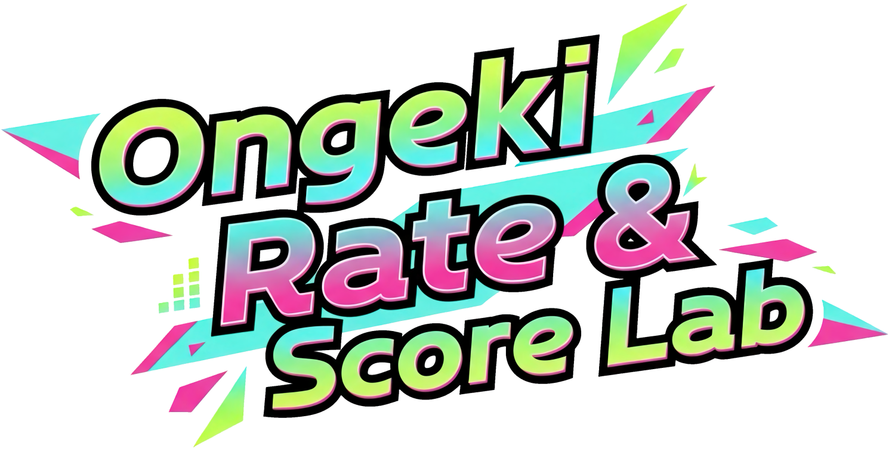

# Ongeki Rate & Score Lab

音楽ゲーム「オンゲキ」のスコアとレートに関する計算・分析ツールです。
単曲のレート値を計算したり、OngekiScoreLogのユーザーIDを入力してご自身のベスト枠（対象曲）を簡単に確認したりすることができます。

## 主な機能

- **単曲レート計算**: スコアからレート値を、または目標レート値から必要なスコアを双方向に計算できます。曲名検索にも対応しています。
- **ベスト枠分析**: OngekiScoreLogのユーザーIDを入力するだけで、現在のベスト枠（旧曲: 50曲 / 新曲: 10曲）を自動で取得・表示します。
- **おすすめ楽曲提案**: 「次点候補」や「伸びしろ枠」など、レートを効率的に上げるための楽曲を提案します。
- **画像生成機能**: 計算したベスト枠を一枚の画像として生成し、ダウンロードしたりSNSなどで簡単に共有したりできます。

## 使い方

1.  **単曲レート計算**
    - サイト上部の「Score → Rate」または「Rate → Score」タブを使い、譜面定数とスコア（または目標レート）を入力します。

2.  **ベスト枠の確認**
    - ご自身のOngekiScoreLogのユーザーIDを入力し、「データ取得」ボタンをクリックします。
    - ベスト枠、新曲枠、おすすめ楽曲などが自動で表示されます。

## 注意事項

- 同一レート値の楽曲が複数存在する場合、ゲーム内の公式ベスト枠と一部の楽曲が入れ替わって表示されることがあります。
- 楽曲の譜面定数は、非公式の情報を参照しているため、実際の値と異なる場合があります。
